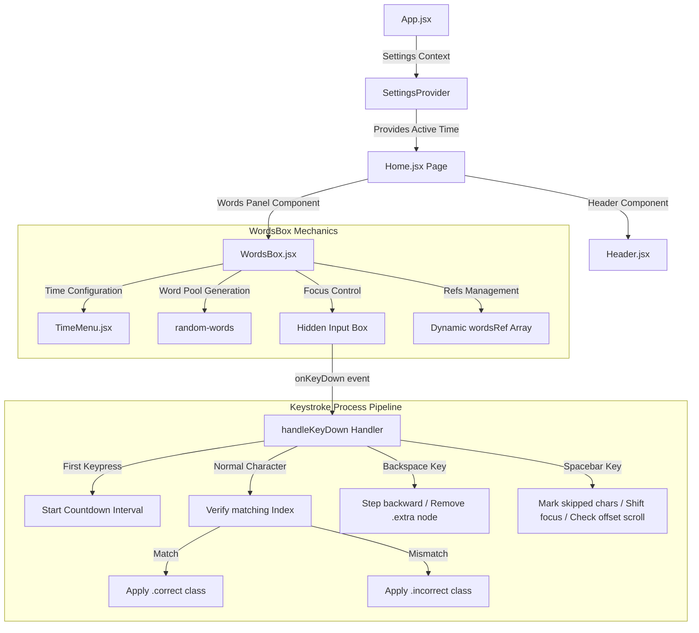

# ⚡ TypeBlitz

TypeBlitz is a high-performance, real-time typing speed and accuracy testing application. Designed for minimal latency and a seamless typing experience, it offers instant visual feedback, custom timing configurations, and dynamic pagination.

🔗 **Live Deployment:** [https://typeblitz-sigma.vercel.app/](https://typeblitz-sigma.vercel.app/)

---

## 📖 What is TypeBlitz?

TypeBlitz is a modern web application designed for typists, programmers, and anyone looking to measure and improve their typing speed. It displays a dynamically generated pool of words and monitors keystrokes in real-time. By utilizing a hidden input element and direct DOM ref targeting, the application guarantees that typing inputs are processed instantly without the overhead or latency typical of heavily-controlled text areas.

---

## 💡 What It Solves

* **Keystroke Delay / Lag:** Traditional web-based typing apps often experience keyboard latency or lag on low-end devices due to excessive state re-renders. TypeBlitz solves this by using local DOM node references (`createRef`) to manipulate classes directly rather than re-rendering the entire word list on every keystroke.
* **Complex Setup & High Footprint:** Many alternative platforms use heavy visual dependencies or canvas elements. TypeBlitz provides a sleek, lightweight experience with zero external component library bloat.
* **Accuracy and Edge-case Tracking:** TypeBlitz solves the issue of tracking skipped letters, extra letters, and backspaces correctly. When users press `Space`, missed characters are accurately categorized as skipped, and extra typed letters are appended/removed dynamically.

---

## ⚔️ How Better It Is From Others

| Feature | ⚡ TypeBlitz | Standard Typing Apps |
| :--- | :--- | :--- |
| **Input Latency** | **Near-Zero** (Manipulates classes directly via `createRef` children) | Higher (Frequent React-state triggers on every letter) |
| **Scroll Engine** | **Viewport-aware autoscroll** using `.scrollIntoView()` offsets | Static or manual scroll setups |
| **Dependencies** | Minimal (**React 19 + React Router 7 + random-words**) | High (Material UI, Framer Motion, heavy assets) |
| **Accuracy Model** | Tracks Correct, Incorrect, Skipped, and Extra characters | Simple correct/incorrect word checking |
| **Weight** | **Extremely lightweight** and fast load times | Large bundle sizes with bloated styling |

---

## 🏗️ Architecture & Data Flow

Below is the conceptual architecture of TypeBlitz, illustrating the component interactions, context state management, and key event-handling pipeline.



### Key Technical Mechanisms:
1. **Dynamic Ref Array (`wordsRef`):** Upon initial word generation, an array of React refs matching the word count is initialized. This allows the application to directly target the active word container and its child character nodes to add/remove classes like `.cursor-current`, `.correct`, and `.incorrect` with minimal performance footprint.
2. **Scroll Checking:** On pressing Space, TypeBlitz checks if the upcoming word wraps to the next line by comparing offsets:
   ```javascript
   if (wordsRef[currWordInd + 1].current.offsetLeft < wordsRef[currWordInd].current.offsetLeft) {
       wordsRef[currWordInd].current.scrollIntoView();
   }
   ```
   This keeps the currently active line centered within the viewport bounds.
3. **Accuracy Formula:**
   $$\text{Accuracy (\%)} = \left( \frac{\text{Correct Characters}}{\text{Correct} + \text{Incorrect} + \text{Extra} + \text{Missed}} \right) \times 100$$
4. **WPM Formula:**
   $$\text{WPM} = \frac{\text{Correct Characters} / 5}{\text{Selected Time in Minutes}}$$

---

## 📂 Project Structure

```bash
TypeBlitz/
├── public/                 # Static assets (logo, icons)
├── src/
│   ├── components/         # Reusable UI components
│   │   ├── Header.jsx      # Navigation header & auth links
│   │   ├── TimeMenu.jsx    # Speed test duration settings selector
│   │   └── WordsBox.jsx    # Core typing box engine
│   ├── context/            # React Context files
│   │   └── SettingsContext.jsx # Global countdown settings
│   ├── pages/              # Routing page views
│   │   └── Home.jsx        # Landing and main game interface
│   ├── styles/             # Application styles
│   │   └── style.css       # Core typography, dark mode, cursors & blinking animation
│   ├── App.css
│   ├── App.jsx             # React routing entry point
│   ├── index.css           # Tailwind/Base styles
│   └── main.jsx            # DOM mounting root entry
├── index.html              # Document wrapper template
├── package.json            # Scripts & project dependencies
└── vite.config.js          # Vite custom build config
```

---

## ⚙️ Installation & Local Setup

Get your local instance of TypeBlitz running in under 2 minutes:

### Prerequisites
Make sure you have [Node.js](https://nodejs.org/) installed on your machine.

### Steps

1. **Clone the repository:**
   ```bash
   git clone https://github.com/Phantom-TA/TypeBlitz.git
   cd TypeBlitz
   ```

2. **Install project dependencies:**
   ```bash
   npm install
   ```

3. **Start the development server:**
   ```bash
   npm run dev
   ```

4. **Access the application:**
   Open your browser and navigate to `http://localhost:5173` (or the local port shown in your terminal).

---

## 🛠️ Build and Production Deployment

To generate a fully optimized build folder:

```bash
npm run build
```

This compiles your assets into the `dist/` directory. You can preview the production build locally:

```bash
npm run preview
```

### Deploying to Vercel
The production version is currently hosted on Vercel. To deploy your own instance:
1. Connect your repository to Vercel.
2. Select **Vite** as the framework preset.
3. Keep the default settings and hit **Deploy**.

---

## 📄 License

This project is open-source and available under the MIT License.
